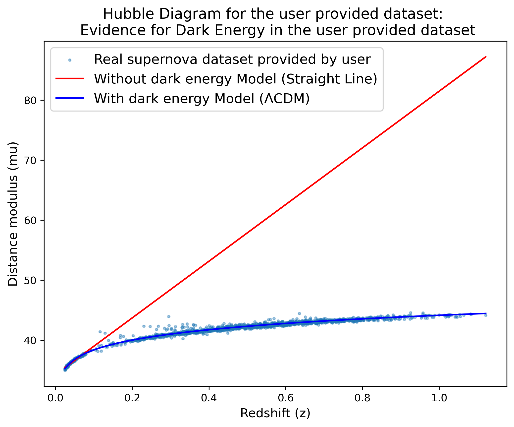
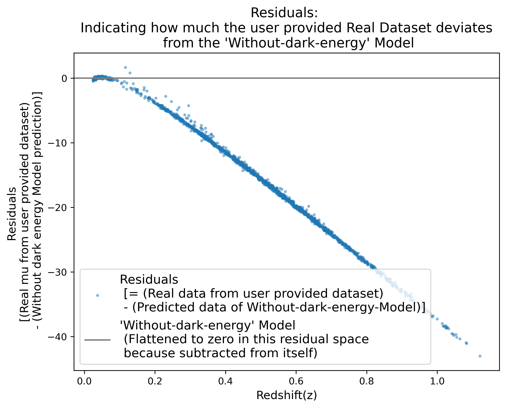

## 🌿Author: 

Anushka Sanjay Tilekar.

- GitHub: [@AnushkaTilekar](https://github.com/AnushkaTilekar)
- E-Mail: anushka.tilekar.23@alumni.ucl.ac.uk

---
# ¶ About This 'Dark Energy Evidence' Package:

This is a Python package that re-creates the classical historical argument for dark energy.
(Kindly NOTE: 
At the time of creation and testing of this version of this package, a real DES Type-Ia supernova dataset was used.

This package fits a simple "Without-dark-energy" Model hubble line, which happens to be a straight line, to the nearby supernovae, then shows how the distant supernovae in this real dataset systematically deviates from that line.

This is the same visual evidence that led astronomers to propose the existence of dark energy in 1998 [*Add reference Research Paper link here.*]

## ¶ What this package basically does? :

Answer:

(1) This Python-based package first loads the redshift and distance-modulus data from the user provided .csv file format dataset.

(2) Then this package fits the Hubble's original 1929 linear law to the low-redshift values, indicating prediction for a universe 'WITHOUT' the presence of dark energy. (- In case of the real DES Type-Ia supernova dataset that was used at the time of creation and testing of this version of this package, this indicates the 'nearby' supernovae.)

(3) Then using the Python based "astropy" library's 'cosmology module' (= i.e. 'astropy.cosmology'), this package computes what a universe 'WITH' the prsence of dark energy predicts for the distance modulus at each redshift in this user given dataset (i.e. it fits the Flat Lambda-CDM model on the user provided dataset.)

(4) Then using the results obtained from these 2 fits, this package then plots these two models against the user provided dataset for visual comparison. => This plot is referred to as the "Hubble Diagram" in this package.



(5) Then, this package creates one more plot, called "Residuals", which shows how far the user given dataset falls from the earlier calculated 'WITHOUT dark energy' line prediction. This plot helps the user to visulise how the deviation grows with redshift in their dataset.



## ¶ Package Installtion Instructions:

To clone this GitHub repository, and further to install it locally on your machine, kindly give the following commands as input:
(To install the development version from GitHub:)

```bash
# 1. Clone the repository
git clone https://github.com/AnushkaTilekar/dark_energy_evidence_github.git

# 2. Move into the project folder
cd dark_energy_evidence_github

# 3. Install the package in development mode
pip install -e .
```

## ¶ After Installation, To Quickstart this package, Kindly give the following commands a input:

```python
from dark_energy_evidence_package.data_loader import load_supernova_data
from dark_energy_evidence_package.without_dark_energy import fit_no_dark_energy_line
from dark_energy_evidence_package.with_dark_energy import predict_distance_modulus_with_dark_energy_presence
from dark_energy_evidence_package.graphs import plot_hubble_diagram, plot_residuals

import numpy as np

# Load your dataset 
# (Kindly make sure to have your dataset in .csv file format and that the file explicitly contains columns named 'z', 'mu', 'mu_err'. Thank you.)
# Kindly Replace 'your_data.csv' below with the actual path to your CSV file
# E.g. : "z, mu, mu_err = load_supernova_data('downloaded_dataset_files/our_new_custom_DES_SN5yr_dataset.csv')"
z, mu, mu_err = load_supernova_data('your_data.csv')

# Fit the simple, Without-dark-energy-Model straight line
slope, intercept = fit_no_dark_energy_line(z, mu)

# Predict what a With-dark-energy universe Model would look like on the same dataset
z_grid = np.linspace(z.min(), z.max(), len(z))
predicted_mu_with_dark_energy = predict_distance_modulus_with_dark_energy_presence(z_grid)

# Visualize both models against the user provided real dataset
plot_hubble_diagram(z, mu, slope, intercept, z_grid, predicted_mu_with_dark_energy)
plot_residuals(z, mu, slope, intercept)

```

## ¶ Cosmological Parameters Used:

In this version of this package, the default cosmological parameters (H0 = 67.66, Om0 = 0.3096) are derived from the same CAMB-based cosmological parameters used in the Author's prior work (H0 = 67.66, ombh2 = 0.02242, omch2 = 0.11933), consistent with the CMB-based measurements.

**Further Simplified Explanation:**

By default, this package's "With-dark-energy Model" (i.e. the Flat Lambda-CDM Cosmology Model) uses:

| Parameter | Default Value | Meaning |
|---|---|---|
| 'H0' | 67.66 km/s/Mpc | Hubble constant (indicating the present-day expansion rate of the universe) |
| 'Om0' | 0.3096 | Total matter density fraction (ordinary + dark matter, combined) |
|---|---|---|

These values are not arbitrary defaults - they are derived from the same cosmological parameter set used in the Author's prior CAMB-based cosmology work. :
H0 = 67.66 , ombh2 = 0.02242 , omch2 = 0.11933

Further converting the physical densities ('ombh2', 'omch2') into the fractional density astropy expects:
h = H0 / 100 = 0.6766
Om0 = (ombh2 + omch2) / (h^2) = (0.02242 + 0.11933) / (0.6766^2) ~= 0.3096

Both values are consistent with the recent CMB-based cosmological measurements. 

**A Note on dark matter:**
In this version of this package, 'Omo' here represents the *total* matter density (ordinary + dark matter combined). In this versoin of this package, it is assumed that they both behave almost identically in how they influence the universe's expansion history. Hence, here, they are not tracked as separate terms in the underlying Friedmann equations.

**A Note on dark energy:**
In this version of this package, the Dark Energy is assumed to behave as a cosmological constant (with the equation-of-state parameter w=-1), to be consistent with the standard Lambda-CDM model. 

**A Note For All Users:**
In this version of this package, to improve the user accessibility, the Author has deliberately designed both the 'H0' and the 'Om0' values in the 'predict_distance_modulus_with_dark_energy_presence()' funciton, to be user-adjustable arguments, so that users are not forced or locked into using any pre-set specific values for these critical cosmological parameters.

## ¶ Input Data Source

This version of this package was designed using the dataset included in the folder named "dark_energy_evidence_github/downloaded_dataset_files/" on the Github repository available on the Author's GitHub page.
This datset is taken from the official **DES-SN5YR** (Dark Energy Survey, 5-Year Supernova) data release:

> DES Collaboration, "Dark Energy Survey Year 6 Results: Photometric Data Set for Cosmology," Bechtol, K. et. al., 2025, 
> [arXiv:2501.05739](https://doi.org/10.48550/arXiv.2501.05739)

Data downloaded from Zenodo:
[10.5281/zenodo.12720778](https://doi.org/10.5281/zenodo.12720778)

Further, the file named as "custom_choose_req_DES_data.py" in the "dark_energy_evidence_github/downloaded_dataset_files/" folder on the github repository available on the Author's GitHub page, is a conversion script that shows how the raw DES release file was converted into the simplified .csv file format, having explicitly the 'z, mu, mu_err' columns in it, as per the input requirement of this package.

However, this file format and data extraction converison script is not part of the current version of installation of this package; - it has been included on the GitHub repository webpage by the Author only for transparency and as a guide for other users (especially students). This conversion script is expected not to be used for any wrong means by any users. Users will be solelly responsible for misuse of the script with their ill-solicitated datasets or with any ill intentions.

## ¶ Scope And Limitations of this version of this package and GitHub respository:

This version of this package is an academic and exploratory tool that demonstrates the classical Linear-vs-Lambda-CDM argument for the dark energy existence, using real supernova dataset. 

**Precautionary Note From The Author:** 

This verison of this package (or the results obtained from it) should **NOT** be treated as a publication-grade statistical detection pipeline by other users. 

## ¶ License

This project is licensed under the GNU General Public License v3.0. Kindly see the file named "LICENSE" under this repository on the Author's github webpage.


**Kindly note that, this GitHub repository and all files and folders within it, has been included on the GitHub repository by the Author only for transparency and as a guide for all other users (especially students). These files are expected not to be used for any wrong means by any users. Users will be solely responsible for the misuse of any files or scripts within this GitHub repository and package with their ill-solicitated datasets or with any ill intentions.**

---
Thank You!

And, Best Wishes for your project! 😄🌟✨ 

Please Keep Believing In Your Potential!💛✨.

---
# 🌟 Author 🌿

Anushka Sanjay Tilekar.
- GitHub: [@AnushkaTilekar](https://github.com/AnushkaTilekar)
- E-Mail: anushka.tilekar.23@alumni.ucl.ac.uk

---
Date: 01 July, 2026.


